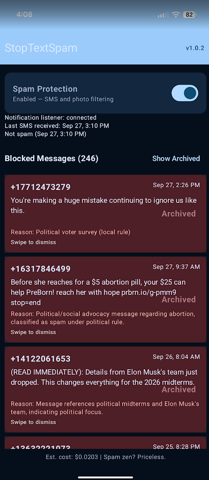

# StopTextSpam

StopTextSpam is an experimental Android companion app that tries to quiet unwanted text notifications. It checks SMS from unknown senders against a local voter-survey rule, then asks OpenRouter to classify other messages. Photo attachment metadata from supported messaging notifications is handled locally. Known contacts are skipped.

This is a companion to a messaging app, not a replacement SMS app. It cannot prevent receipt or delete messages, and notification suppression is not guaranteed. Review blocked messages in the app, since classifier errors can hide legitimate notifications.

## Screenshot

## Build and use

Install JDK 17 and Android SDK 35, then run `./gradlew assembleDebug` (or `./gradlew.bat assembleDebug` on Windows). Android Studio also works. The build does not require an API key.

Install the built APK, open the app, and grant its SMS, contacts, and notification permissions. Enable notification access for StopTextSpam in Android settings. To classify ordinary unknown-sender SMS, enter your own OpenRouter API key in the app. The app does not include an API key in source or in the APK. Without a key, ordinary messages remain visible; the local voter-survey and photo rules still run.

## Privacy and security

- For an unknown sender who is not in contacts, the app sends the sender and SMS body to OpenRouter over HTTPS. A failed primary model request can trigger a second request to a fallback model. Review [OpenRouter's privacy policy](https://openrouter.ai/privacy) before enabling this.
- The notification listener can inspect notifications from supported messaging apps. Photo detection uses attachment MIME metadata locally; it does not upload images.
- Detected spam sender, message body, reason, and time are stored in an app-private Room database. The API key is stored unencrypted in app-private preferences. Android backups are disabled. A compromised or rooted device can still access local app data.
- The app avoids logging sender numbers and message text. Its own spam notification has a generic title; open the app to see details.
- This project asks for `RECEIVE_SMS`, `READ_CONTACTS`, `POST_NOTIFICATIONS`, and notification-listener access. It does not ask for `READ_SMS`.

Never put an API key in Gradle files, source, tests, an APK, or benchmark results. Revoke any key previously embedded in a build before distributing that build.

## Benchmark

The `benchmark/` folder has synthetic examples and a Python standard-library runner. See [benchmark/README.md](benchmark/README.md). Benchmark output can contain message text, model responses, request identifiers, and usage metadata, so `benchmark/results/` is ignored.

## Known limits

Google Messages may post or sound an alert before this app can snooze it. Android may stop the listener or the app's SMS broadcasts. Photo filtering depends on the messaging app exposing image MIME metadata, and group conversations are excluded. The app does not classify MMS bodies or images. Contact lookup failures are treated as private contacts and left alone.
